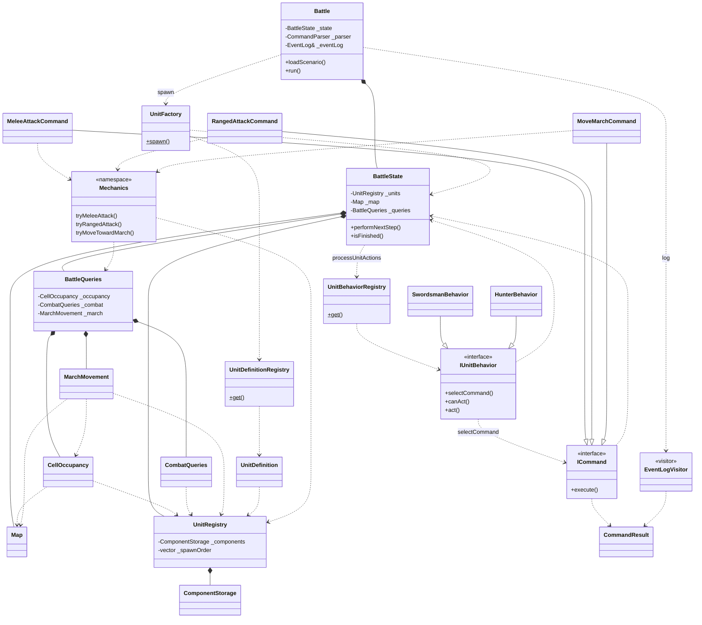
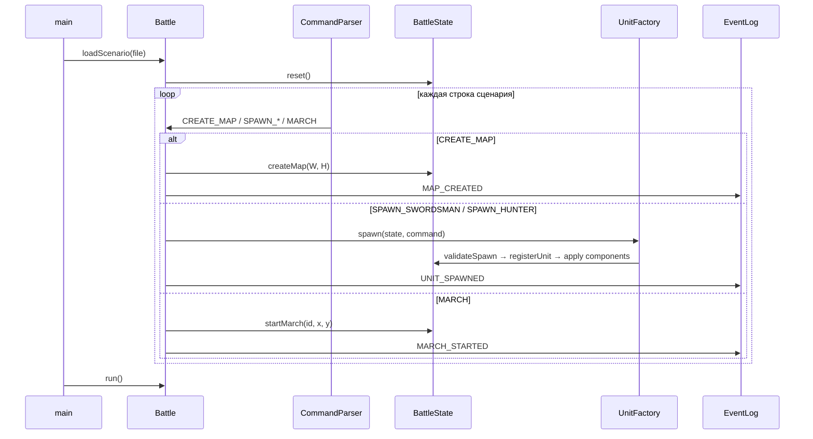
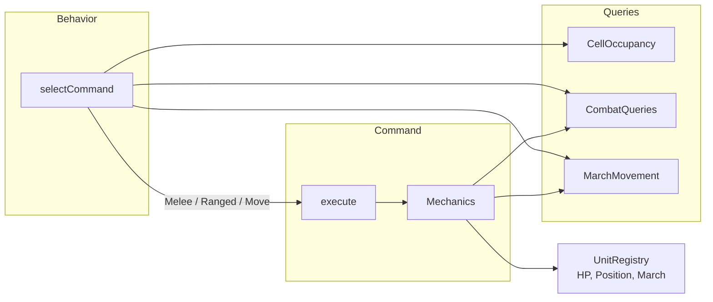

# Design decisions

Раздел для ревьюера: что сделано сознательно, какие узкие места найдены и почему они **не** реализованы.

## Архитектура

- `BattleState` — оркестрация тика: удаление мёртвых, ходы юнитов, условие конца боя.
- `UnitRegistry` + `ComponentStorage` — ECS-lite: компоненты по `EntityId`, порядок ходов через `_spawnOrder`.
- `BattleQueries` — фасад доменных запросов: `CellOccupancy`, `CombatQueries`, `MarchMovement`.
- `IUnitBehavior` + `ICommand` — Strategy/Command: behavior выбирает команду, команда выполняет механику.
- `UnitTrait` — расширяемость под будущих юнитов (ворон без `OccupiesCell`, мина без HP и т.д.).

## Схема классов и зависимостей




**Кратко по слоям:**


| Слой        | Классы                                                              | Роль                             |
| ----------- | ------------------------------------------------------------------- | -------------------------------- |
| Оркестрация | `Battle`                                                            | сценарий, цикл тиков, связь с IO |
| Состояние   | `BattleState`, `Map`, `UnitRegistry`                                | данные боя                       |
| Запросы     | `BattleQueries` → `CellOccupancy`, `CombatQueries`, `MarchMovement` | spatial/combat без логики типов  |
| Юниты       | `UnitFactory`, `UnitDefinition`*                                    | создание и набор компонентов     |
| AI          | `IUnitBehavior`, `*Behavior`, `UnitBehaviorRegistry`                | выбор действия по типу           |
| Действия    | `ICommand`, `*Command`, `Mechanics`                                 | исполнение атаки/движения        |
| Лог         | `EventLogVisitor`                                                   | события → IO                     |


---

## Схема пошаговой работы

### Фаза 1 — загрузка сценария (тик 1)




### Фаза 2 — боевой цикл (тик 2, 3, …)

```mermaid
flowchart TD
    A[Battle::run] --> B{isFinished?<br/>alive ≤ 1 или<br/>!canAnyUnitAct}
    B -->|да| Z[конец]
    B -->|нет| C[performNextStep]

    C --> D[removeDeadUnits<br/>hp=0 → pendingRemoval<br/>UNIT_DIED]
    D --> E[processUnitActions<br/>порядок: _spawnOrder]

    E --> F{для каждого<br/>активного юнита}
    F --> G[UnitBehaviorRegistry::get(type)]
    G --> H[behavior.act(state, id)]
    H --> I[selectCommand → unique_ptr ICommand]
    I --> J{command<br/>!= null?}
    J -->|нет| F
    J -->|да| K[command.execute(state, id)]
    K --> L[Mechanics:<br/>melee / ranged / march]
    L --> M[CommandResult<br/>с событиями]
    M --> F

    F -->|все обработаны| N[logEvents → stdout]
    N --> O[tick++]
    O --> B
```


### Внутри одного хода юнита




**Приоритет действий (из behaviors):**


| Тип       | Порядок выбора                                                   |
| --------- | ---------------------------------------------------------------- |
| Swordsman | Ближняя атака или Марш (если некого атаковать)                   |
| Hunter    | Ближняя атака или Дальняя атака или Марш (если некого атаковать) |


---

Так как в задании прямо сказано: *«Не беспокойтесь о производительности»*, то не все узкие места были оптимизированы. Ниже список того, что еще можно было бы оптимизировать:

### 1. Двойной вызов AI на каждом тике (самое заметное)

**Где:** `Battle::run()` → `isFinished()` → `canAnyUnitAct()` → `canAct()` → `selectCommand()`, затем `performNextStep()` → `act()` → `selectCommand()` снова.

**Вариант улучшения:** один проход «выбрать → выполнить» в `processUnitActions`, флаг продолжения после тика вместо `canAnyUnitAct()` перед тиком.

---

### 2. Spatial-запросы O(N) по всем юнитам

**Где:** `CellOccupancy`, `CombatQueries`, цепочки вызовов из behaviors.

**Вариант улучшения:** grid-индекс `map[x][y] → EntityId` или кэш запросов на один тик.

---

### 3. Мёртвые юниты остаются в `_spawnOrder`

**Где:** `UnitRegistry::_spawnOrder`, `setPendingRemoval()`.

**Вариант улучшения:** `UnitRegistry::removeUnit()` в начале следующего тикас (*«исчезает на следующий ход»)*.

---

### 4. Лишние аллокации `std::vector`

**Где:** API queries возвращает owning-контейнер, behaviors проверяют только `.empty()`.

**Вариант улучшения:** методы `hasAdjacentEnemies()` / `hasEnemiesInRange()` без vector; `selectCommand()` возвращает лёгкий `enum`/optional вместо `unique_ptr` при проверке; thread-local / reusable buffer для списка целей при атаке.

---

